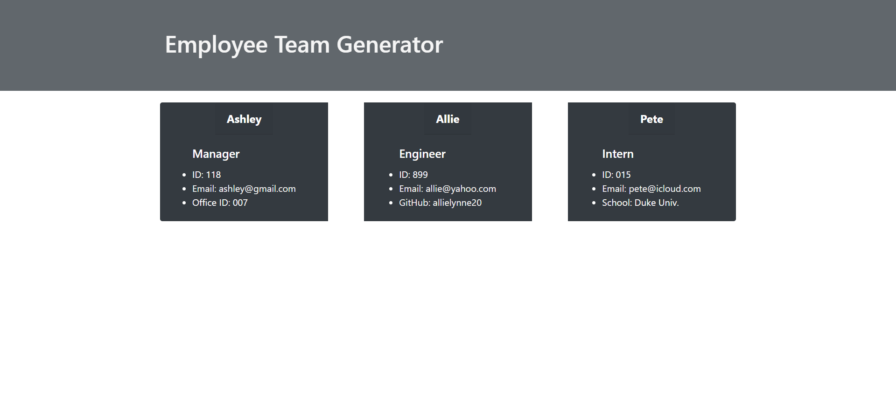

  # **Employee Team Generator**

  

  ## **Description**
  This application begins by prompting the user a series of questions from the command line. The user can then input the Manager information first and is then prompted to add an Engineer or Intern to the team, or they can choose to stop the process. After adding all of the neccessary team members the user can simply choose the option to stop the prompts. When the user chooses this option an html page is dynamically generated from the user's input. The html will show emplyee team member cards on the page. 

  ## **Example HTML this app created!**
  

  ## **Table of Contents**

  * [Installation](#Installation)

  * [Usage](#Usage)

  * [Contributions](#Contributions)

  * [Testing](#Testing)

  * [Questions](#Questions)

  ## **Installation**
  To install this project you will need to download the github link. Then open your terminal in the proper directory, run npm install inquirer, and install Jest to run tests if you would like. Now you can run node index, and you will be prompted to enter answers to questions that will gather the data needed to create the html page.

  ## **Usage**
  This application is meant to create an html file with containing a list of employee team member cards from the user input data. 
  - Here is a video showing how to create the html page: [Team-Generator](https://github.com/allielynne20)

  ## **Contributions**
  There are many ways in which you can contribute to this project, for example:
  - Submit bugs and feature requests
  - Review any code changes 
  - Review documentation for any other errors

  ## **Testing**
  This project has been tested with Jest. You can run it in the terminal starting with node index. You can also write new tests/ alter the tests in the project.

  ## **Questions** 
  If you have any questions in regard to this project please reach out by contacting me through: 
  - My email: allielynne20@gmail.com
  - My GitHub username: [allielynne20](https://github.com/allielynne20)

  **Thank you!** :upside_down_face:

  *Licensed under the MIT.*